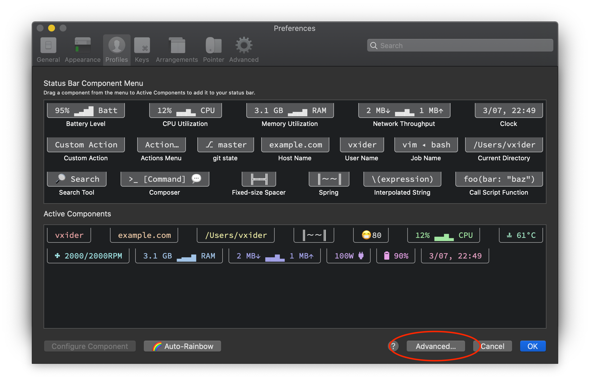
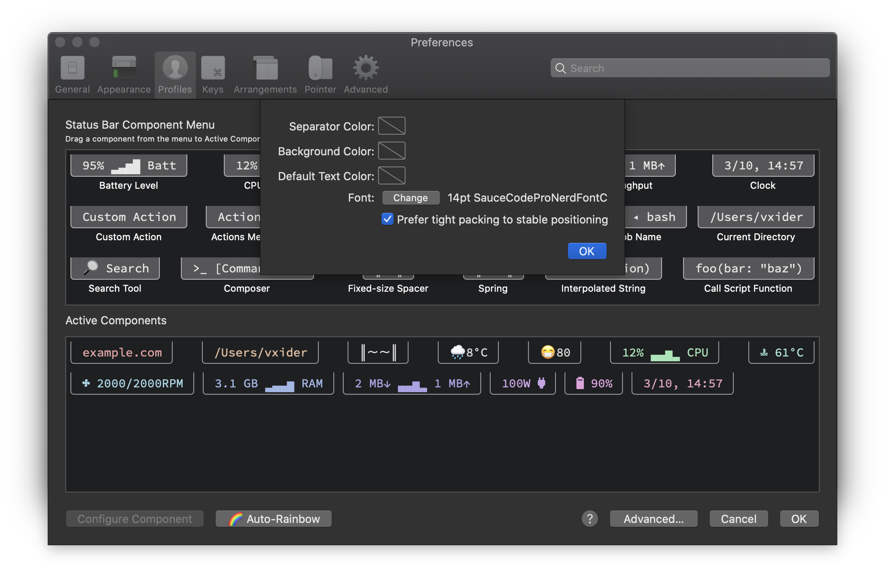
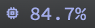

# iterm-components

Custom status bar components for use with iTerm2


# Table of Contents
<!-- @import "[TOC]" {cmd="toc" depthFrom=2 depthTo=6 orderedList=false} -->

<!-- code_chunk_output -->

- [Prerequisites](#prerequisites)
- [Installation](#installation)
- [Components](#components)
  - [System](#system)
    - [Power wattage](#power-wattage)
    - [CPU temperature](#cpu-temperature)
    - [Fan speed](#fan-speed)
    - [Memory usage](#memory-usage)
    - [Battery charge](#battery-charge)
  - [Weather](#weather)
    - [AQI](#aqi)
    - [Local weather](#local-weather)
- [Configuration](#configuration)

<!-- /code_chunk_output -->


## Prerequisites

The components use glyphs from a patched NERDfont. So you need to install a NERDfont and set it as the default font for status bar components.

I use the Source Code Pro patched NERDfont, this and other NERDfonts can be found in [Nerd Font](https://www.nerdfonts.com/). The status bar font of iTerm2 can be setted in `iTerm Preferences->Profile->Session->Configure Status Bar->Advanced`.





## Installation

1. `git clone https://github.com/Vxider/iterm-components.git && cd iterm-components`
1. Install script to iTerm2 by using `./install.sh`. Or copy the scripts you want to `~/Library/Application Support/iTerm2/Scripts/AutoLaunch`
1. Click **Scripts > AutoLaunch** in the iTerm2 menu bar and select the components you want to be available.
1. Open `iTerm Preferences->Profile->Session->Configure Status Bar` and drag the components where you like.

You may need to restart the iTerm after installing the new components to make the scripts loaded.


## Components

### System

#### Power wattage

Display the AC power adapter wattage currently connected.


#### CPU temperature

Display the CPU temperature. (Requires iStats ruby gem)


Install [iStats](https://github.com/Chris911/iStats) by `gem install iStats`

#### Fan speed

Display the fan speed. (Requires iStats ruby gem)


#### Memory usage

Display the memory usage.



#### Battery charge

Display battery charge status and the estimate remaining time.

Charging:


Charged:


### Weather

#### AQI

You need an [aqi api token](https://aqicn.org/api/) and modify the `TOKEN` and `CITY` fields in `weather/aqi.py`.


#### Local weather

Display local weather by [darksky-weather](https://github.com/genuinetools/weather).

Install using Homebrew

```
brew install darksky-weather
```


## Configuration

* The `update interval` of each component can be set by changing `update_cadence`. The unit is second.
