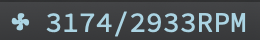
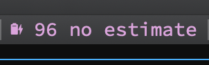

# iterm-components

Custom status bar components for use with iTerm2


# Table of Contents
<!-- @import "[TOC]" {cmd="toc" depthFrom=2 depthTo=6 orderedList=false} -->

<!-- code_chunk_output -->

- [Installation](#installation)
- [Components](#components)
  - [System](#system)
    - [Power wattage](#power-wattage)
    - [CPU temperature](#cpu-temperature)
    - [Fan speed](#fan-speed)
    - [Memory usage](#memory-usage)
    - [Battery charge](#battery-charge)
  - [Weather](#weather)
    - [AQI](#aqi)
    - [Local weather](#local-weather)
- [Configuration](#configuration)

<!-- /code_chunk_output -->


## Installation

1. Install script to iTerm2 by using `./install.sh`. Or copy the scripts you want to `~/Library/Application Support/iTerm2/Scripts/AutoLaunch`
2. Install [Nerd Font](https://www.nerdfonts.com/)
3. Click **Scripts > AutoLaunch** in the iTerm2 menu bar and select the components you want to be available.
4. Open the `Configure Status Bar` in `iTerm Preferences...->Profile->Session`. Then click `Advanced...` and change the font to which installed in the Step.2.
5. Drag the components where you like.

You may need to restart the iTerm after installing the new components to make the scripts reload.


## Components

### System

#### Power wattage

Display the AC power adapter wattage currently connected.


#### CPU temperature

Display the CPU temperature. (Requires iStats ruby gem)


Install [iStats](https://github.com/Chris911/iStats) by `gem install iStats`

#### Fan speed

Display the fan speed. (Requires iStats ruby gem)



#### Memory usage

Display the memory usage.


#### Battery charge

Display battery charge status and the estimate remaining time.

Charging:




Charged:


### Weather

#### AQI

You need an [aqi api token](https://aqicn.org/api/) and modify the `TOKEN` and `CITY` fields in `weather/aqi.py`.


#### Local weather

Display local weather by [darksky-weather](https://github.com/genuinetools/weather).

Install using Homebrew

```
brew install darksky-weather
```


## Configuration

* The `update interval` of each component can be set by changing `update_cadence`. The unit is second.
